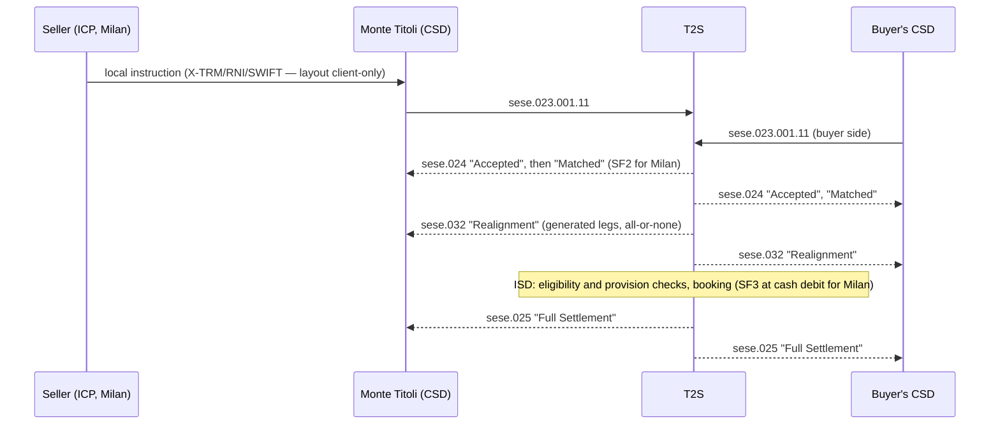

# Cross-CSD DvP in EUR between a Monte Titoli participant and a participant of another T2S CSD — bounded flow, messages and timing

**Question.** Specify the settlement flow, messages and timing for a delivery-versus-payment (DvP) in EUR where the seller is an indirectly connected participant (ICP) of Monte Titoli and the buyer is a participant of another CSD in T2S connected by a direct link, on release R2026.JUN. Say what is not verified.

## 0. Scope block

| Item | Value | Label |
|---|---|---|
| CSDs | Seller's CSD: Monte Titoli (Euronext Securities Milan). Buyer's CSD: another CSD in T2S. Both in T2S; direct link between them (link model `direct-both-in-T2S`) | Stated assumption |
| Route | Cross-CSD settlement in T2S (not external-CSD) | Stated assumption, consistent with [[milan-cross-csd-disclosure]] |
| Roles | Seller = Monte Titoli participant (ICP, instructing through X-TRM); buyer = participant of the other CSD; cash agents/DCAs on both sides; T2S as settlement platform; the two CSDs as T2S actors | Stated assumption |
| Instrument, link, accounts | One eligible ISIN with a valid issuer/investor relationship and omnibus/mirror accounts configured between the two CSDs | **Unresolved requirement** — per-ISIN eligibility is blocked (G04); see retrieval 7 in the bundle |
| Platform release | R2026.JUN (deployed; effective from mid-June 2026) | Documented requirement [[t2s-schedule-r2]] |
| Currency, payment type | EUR, DVP | Stated assumption (only ICP/EUR/direct link is a reviewed message-flow scenario) |
| Access model | Seller ICP (Monte Titoli submits to T2S); buyer's access model not assumed | Stated assumption |
| Evidence review dates | 13 September 2026 (messages, realignment, posting, Milan finality) and 14 September 2026 (schedule, RTS phase, sese.024 usages, Milan Article 77) | Documented |
| Business date | Nominal baseline only (no business date supplied); actual dates need the dated event overlay | Documented [[t2s-schedule-r2]] |
| Quarantines | Milan Settlement Instructions §1.3.1 clock table (19:30 / two windows) is quarantined; not used | Documented |

## 1. Preconditions

- **Documented requirement.** Monte Titoli settles cross-CSD only when the issuer CSD is in T2S, or both investor CSDs hold links with another CSD in T2S so that realignment with an issuer CSD outside T2S is unnecessary. [[milan-cross-csd-disclosure]] Service Regulations 26 January 2026, Article 77(2), PDF 54; reviewed 14 September 2026; English translation, Italian text prevails.
- **Documented requirement.** Realignment relies on "links set in the reference data between the relevant CSDs": each investor CSD must have defined a technical issuer CSD (default link, optional alternatives) for the ISIN. [[t2s-realignment]] UDFS R2026.JUN §1.6.1.10.1 and §1.6.1.10.3, PDF 373–376; reviewed 13 September 2026.
- **Unresolved requirement.** Whether the chosen ISIN is eligible, which CSD is issuer/technical issuer for it, and which securities and cash accounts are used are static data not in reviewed evidence (blocked topic `instrument_eligibility`, gap G04: "Current ISIN, CSD-link, account, currency and MT23/static-data evidence required").

## 2. Business sequence and observable states

1. **Instruction capture at the local CSD (seller side).** The seller, as ICP, sends its instruction to Monte Titoli's X-TRM service, which submits a T2S settlement instruction on its behalf. **Documented requirement** at the level of the Service Regulations: acquisition of settlement instructions takes place through X-TRM or through systems connected directly to T2S; matching and settlement occur in T2S. [[milan-finality]] cites Articles 69–72 only; the acquisition rule is Article 58(3) in the Milan section `milan-settlement-characteristics`, which is not in this bundle — **reasoned inference from the ICP assumption**, to be confirmed with that section.
2. **T2S validation.** The instruction is validated against reference data; for Monte Titoli, the end of validation in T2S is the moment of entry into the settlement system (SF1). **Documented requirement.** [[milan-finality]] Article 72(1), PDF 51; reviewed 13 September 2026; Italian text prevails.
3. **Matching.** T2S matches the seller's and buyer's instructions. From matching, Monte Titoli's instruction "cannot be revoked by a participant or a third party" (SF2), "without prejudice to the bilateral cancellation" with both participants' consent under Article 70(2). **Documented requirement.** [[milan-finality]] Article 72(2) and Article 70(2), PDF 50–51; reviewed 13 September 2026; Italian text prevails. Observable status: `Matched` status advice (see message table).
4. **Realignment generation.** "Once incoming Settlement Instructions are matched … the realignment application process creates automatically all the requested Settlement Instructions between the involved CSDs", validated and linked to the business instructions with two INFO links, "and their business Settlement Instructions settle on an all-or-none basis". If the realignment cannot be built, the inbound instruction is cancelled. **Documented requirement.** [[t2s-realignment]] UDFS §1.6.1.10.1–1.6.1.10.2, PDF 373–375; [[t2s-messages]] UDFS §2.3 "Realignment Chain Analysis", PDF 753; both reviewed 13 September 2026. Generation is not a completed movement.
5. **Posting on the intended settlement date.** Business and realignment instructions "are submitted to the posting application process at the Intended Settlement Date", grouped for all-or-none settlement; eligibility check (no hold, no applicable cut-off, no intraday restriction), provision check (securities, cash, limits; partial settlement and auto-collateralisation under conditions), then booking, "making the settlement irrevocable". **Documented requirement.** [[t2s-posting]] UDFS §1.6.1.8.1–1.6.1.8.2, PDF 303–305; reviewed 13 September 2026.
6. **Finality for the Monte Titoli participant.** "The transfer of securities and cash become final from the time of the debiting of the cash" (SF3). **Documented requirement.** [[milan-finality]] Article 72(3), PDF 51; reviewed 13 September 2026; Italian text prevails. The finality point for the buyer's CSD is that CSD's own rule — **unresolved requirement** in this bundle.
7. **Failure handling.** If the first attempt fails, the instruction is re-attempted after the removal of a restriction, release of a hold, arrival of missing linked instructions, increase of a limit or arrival of resources; pending instructions roll to the next settlement day. **Documented requirement.** [[t2s-posting]] PDF 304; reviewed 13 September 2026.

## 3. Message table

Layer A (client to CSD) is Monte Titoli's X-TRM/RNI/SWIFT interface and is **not** in this bundle: its layouts are client-only (gap G03). Layer B/C below are T2S-native messages between the CSDs and T2S.

| # | Layer | Sender → Receiver | Message and version | Usage / trigger | Source locator | Label |
|---|---|---|---|---|---|---|
| 1 | B | CSD (or DCP) → T2S | `sese.023.001.11` SecuritiesSettlementTransactionInstruction | Settlement instruction entering T2S | [[t2s-messages]] UDFS §2.3.8.1, PDF 778; reviewed 13 Sept 2026 | Documented requirement |
| 2 | C | T2S → CSD/actor | `sese.024.001.12` SecuritiesSettlementTransactionStatusAdvice — usages "Rejected", "Accepted", "Accepted with Hold", "Accepted with CSD Validation Hold", "Matched", "Cancelled", "No hold remain(s)", "Eligibility Failure", "Intraday Restriction", "Provision Check Failure", "Partial Settlement (unsettled part)", "CoSD Hold", "CoSD awaiting from Administering Party", "Counterparty's Settlement Instruction on Hold" | Status changes through the lifecycle | [[t2s-messages]] §2.3.8.2, PDF 778 | Documented requirement |
| 3 | C | T2S → counterparty's CSD | `sese.028.001.10` SecuritiesSettlementTransactionAllegementNotification; `sese.029.001.06` SecuritiesSettlementAllegementRemovalAdvice | Counterparty instruction missing; allegement removed on matching/cancellation | [[t2s-messages]] PDF 778 | Documented requirement |
| 4 | C | T2S → CSDs in the chain | `sese.032.001.11` SecuritiesSettlementTransactionGenerationNotification / "Realignment" | Sent "to the CSD involved in the realignment chain to notify the creation of additional instructions to be settled on their accounts", carrying the business references and the T2S Matching Reference | [[t2s-messages]] §2.3 PDF 753 and §2.3.8.2 PDF 778 | Documented requirement |
| 5 | C | T2S → CSD/actor | `sese.025.001.11` SecuritiesSettlementTransactionConfirmation — "Full Settlement", "Last Partial Settlement", "Partial Settlement (settled part)" | Booking completed | [[t2s-messages]] PDF 778 | Documented requirement |
| 6 | C | T2S → CSD/actor | `semt.020.001.07` SecuritiesMessageCancellationAdvice | Listed among outbound messages of the dialogue | [[t2s-messages]] PDF 778 | Documented requirement (usage conditions not in excerpt) |
| 7 | C | T2S → actor | `sese.024.001.12` hold usages "Party Hold", "CSD Hold", "Accepted with CSD Validation Hold", "CoSD Hold", "No Hold remain", "Other Hold remain(s)"; footnote 417: a settlement status/reason reported alone normally implies "matched", with four listed exceptions for hold statuses | Hold-related reporting | [[t2s-sese024-usages]] UDFS §3.3.6.5.1, PDF 1257–1258; reviewed 14 Sept 2026 | Documented requirement |
| A | A | Seller → Monte Titoli (X-TRM) and back | RNI G50–G53/G56–G58, SWIFT MT540–MT548/MT598 or MT-X on-line, per Milan's access table | Local capture, status relay | Not in this bundle — see `milan-xtrm-service`; layouts client-only (G03) | Unresolved requirement |

Field-level content (element cardinalities, business rules, XML) for these messages is **not** admitted: the UDFS schema section and MyStandards usage guidelines are outside reviewed evidence (gap G14). No production XML is given.

## 4. Timing (nominal baseline, R2026.JUN)

- **Documented requirement.** The T2S settlement day: start of day from 18:45 to 20:00 CET (change of business date; 19:00 final deadline for data feeds; 20:00 final deadline to accept settlement instructions for the first night-time sequence), night-time settlement 20:00–3:00 in two cycles (first cycle target end 20:20, last cycle target end 00:00, volume dependent), maintenance window 3:00–5:00 (weekend 2:30 Saturday to 2:30 Monday), real-time settlement from 5:00 (or after NTS) to 18:00 with five partial settlement windows and the closure cut-offs, end of day 18:00–18:45. The start-of-day period "starts after the successful completion of the previous EOD period and after 18:45". [[t2s-schedule-r2]] UDFS §1.4.2 and Table 37, PDF 156–163, and §1.4.4.1 PDF 163; reviewed 14 September 2026.
- **Documented requirement.** Closure cut-offs: "start of cut-off phase with DVP cut-off at 16:00 hrs CET and end of cut-off phase at 18:00 hrs CET with FOP cut-off"; the DVP cut-off "remains harmonised for all currencies at 16h00"; the T2S Operator may change currency-dependent cut-offs for the current day in exceptional circumstances. [[t2s-schedule-r2]] §1.4.2, PDF 156–158; reviewed 14 September 2026.
- **Documented requirement.** Partial settlement windows during real-time settlement: 08:00–08:30, 10:00–10:15, 12:00–12:15, 14:00–14:15 and a fifth window 30 minutes before the DVP cut-off, "between 15:30 and 16:05 or the closure of both DVP cut-offs (whichever comes first)". [[t2s-rts-phase]] UDFS §1.4.4.4, PDF 193–194; reviewed 14 September 2026.
- **Reasoned inference.** For a trade on Monday with intended settlement date Wednesday (two business days later under the applicable calendar), the Wednesday T2S settlement day can open on Tuesday evening after 18:45; instructions received by 20:00 Tuesday enter the first night-time sequence. Matching may happen at any time after both instructions are validated; it is not an appointment.
- **Unresolved requirement.** Submission, matching and settlement times are not guaranteed; an actual business date requires the dated ECB overlay for that date (none was requested here). Monte Titoli's participant-level cut-offs for submitting through X-TRM are not in reviewed evidence (gap G01); the Milan Instructions' clock table is quarantined.

## 5. Exceptions and controls

- Hold/release, amendment and cancellation follow the T2S maintenance processes (not in this bundle; sections `t2s-hold-release`, `t2s-amendment`, `t2s-cancellation`), with Monte Titoli's Article 70 cancellation rule as the legal boundary after matching. **Documented requirement** for the boundary: [[milan-finality]] Article 70(1)–(2), PDF 50; reviewed 13 September 2026.
- Insufficient securities or cash: re-attempt on arrival of resources; partial settlement and auto-collateralisation "can be used under specific conditions". **Documented requirement.** [[t2s-posting]] PDF 305; reviewed 13 September 2026.
- Realignment that cannot be generated cancels the inbound instruction. **Documented requirement.** [[t2s-messages]] PDF 753.
- **Proposed design choice.** Store the T2S Matching Reference carried by the realignment notification alongside the business instruction references for reconciliation across the chain.

## 6. Finality and cancellation boundaries

Monte Titoli side: SF1 at end of T2S validation, SF2 at matching (bilateral cancellation still possible), SF3 at cash debit. **Documented requirement** [[milan-finality]] Article 72(1)–(3); Italian text prevails; reviewed 13 September 2026. The buyer's CSD applies its own moments of entry, irrevocability and finality (not in this bundle).

## 7. Acceptance criteria (evidence-tied)

1. A `sese.024.001.12` "Matched" advice is received before any settlement confirmation; no process treats "Matched" as settled. [[t2s-messages]]
2. For every cross-CSD instruction, a "Realignment" `sese.032.001.11` is received by the CSD(s) in the chain and carries the business references and Matching Reference. [[t2s-messages]] PDF 753.
3. Settlement completion is recognised only on `sese.025.001.11` "Full Settlement" or "Last Partial Settlement". [[t2s-messages]] PDF 778.
4. The operational calendar used for ISD counting is the T2S calendar for EUR, and the intended settlement day is processed from 18:45 the previous evening. [[t2s-schedule-r2]]

## 8. Open dependencies blocking a production specification

| Missing item | Gap | Affected rows | Route |
|---|---|---|---|
| Per-ISIN eligibility, issuer/technical issuer and account links | G04 | Scope, §1, §2 step 4 | MT-X Lists → MT23; CSD account links |
| Milan X-TRM message layouts (Standard for X-TRM Users A2A/RNI VER.01.09) | G03 | Message row A | MT-X Docs → Live Services → Technical Documentation |
| MyStandards usage guidelines and XSDs for sese.023/024/025/032 (R2026.JUN) | G14 | Field-level content | MyStandards account |
| Buyer-CSD finality rules and the buyer's access model | — | §2 steps 6–7, §6 | The other CSD's rulebook |
| Milan participant cut-offs after R2026.JUN | G01 | §4 | Milan operational notices / MT-X |
| Dated event overlay for the actual business date | G02 | §4 | ECB T2S status history (reviewed dates listed in the topic index) |

*Authored by the library maintainer on 14 September 2026 from `bundle.json` in this folder and checked with `settlement_agent.py check` (`checks.json`). Worked example of a scoped specification; not a production specification and not a model output.*
