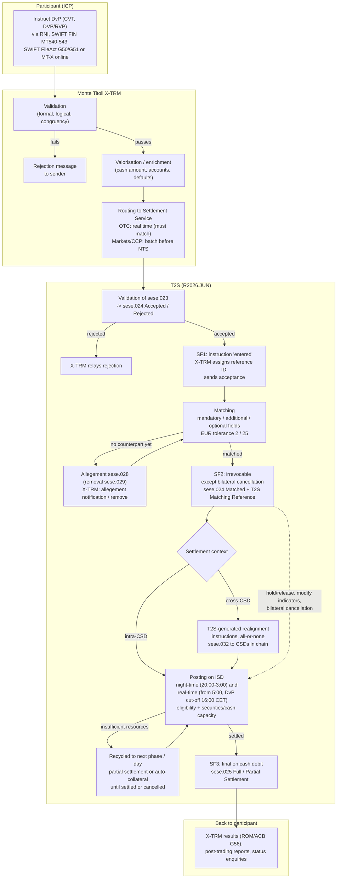

# How Euronext Securities Milan interacts with T2S for a standard DvP transfer, and where SWIFT sits

**Scope adopted (stated assumptions):** OTC delivery-versus-payment (DvP) between two Milan participants, settled in EUR on T2S; the sending participant is an ICP (indirectly connected participant) using Monte Titoli's X-TRM service; intra-CSD, nominal business day, T2S release R2026.JUN (the deployed release). The cross-CSD branch is described where the evidence covers it. Evidence review dates: 13 September 2026 (Regulations, T2S UDFS) and 14 September 2026 (Settlement Service Instructions, SWIFT release notice). The evidence bundle was complete for every retrieval (all `evidence_only`); none was blocked or truncated.

## Direct answer

Milan participants reach T2S in one of two ways: **indirectly**, by sending instructions to Monte Titoli's X-TRM service, which validates, enriches and routes them into T2S and relays T2S results back; or **directly** as a DCP, over a network service provider indicated by the ECB, with Monte Titoli's authorisation and ECB certification [[milan-connectivity-static-data]] Instructions to Settlement Service in force as of 30 June 2025 (MN_10/2025), §1.1.1, PDF 7; reviewed 2026-09-14; English translation, Italian text prevails. In the reviewed evidence SWIFT appears in two documented roles: as one of the **access channels to X-TRM** (SWIFT FIN/InterAct carrying MT540–MT543 and MT548, and SWIFT FileAct carrying the G50/G51/G56 files) [[milan-xtrm-service]] Instructions, §3.3 access-method table, PDF 37; reviewed 2026-09-14; transcribed from the page image, Italian prevails; and as the **SWIFT Annual Release 2026** that ES-MIL will implement with go-live scheduled for 16 November 2026 [[milan-swift-sr2026]] ON_30/2026 SWIFT Annual Release 2026 (24 July 2026), PDF 1–3; reviewed 2026-09-14; notice, not Regulations, PRIVATE footer, future mode. **Explanation, not documented requirement:** SWIFT is also, in market practice, one of the licensed T2S network service providers; the reviewed Regulations only say a DCP must contract with "one of the Network Service Providers indicated by the ECB" and do not name SWIFT, so which NSP a DCP uses is not in reviewed evidence.

Inside T2S the transfer moves through validation, matching, an optional realignment step, and posting; Milan attaches its three legal finality moments to these steps: SF1 at the end of T2S validation, SF2 at matching, SF3 at the debit of cash [[milan-finality]] Regulations as of 26 January 2026, Article 72(1)–(3), PDF 51; reviewed 2026-09-13; English translation, Italian text prevails.

## Flow chart

The diagram adds nothing the text below lacks; step numbers follow it.

## Step by step, with evidence

**0. Preconditions (documented requirement).** A participant must continuously hold a securities account at Monte Titoli, have T2S dedicated cash accounts or use an agent bank for cash settlement, and send instructions through X-TRM or another adequate direct connection system, proving this through tests arranged by Monte Titoli [[milan-access]] Regulations as of 26 January 2026, Article 60(1), PDF 44; reviewed 2026-09-13; English translation, Italian text prevails. DCPs must additionally have business continuity plans, an agreement with an ECB-indicated network service provider, and the ECB certification of conformity [[milan-access]] Regulations, Article 60(2), PDF 44–45; reviewed 2026-09-13; same qualification. Static data (participant, clients, agent banks) is set up by Monte Titoli from information the participant enters in CLIMP; a unique LEI is required before configuration on T2S; securities accounts must be connected to a dedicated cash account (DCA) at T2S, and Monte Titoli configures the DCA links per the participant's guidance [[milan-connectivity-static-data]] Instructions, §§1.2.1–1.2.2, PDF 7–9; reviewed 2026-09-14; Italian prevails.

**1. The participant instructs X-TRM (documented requirement).** A sale or purchase of securities is acquired as operation type CVT with transaction type DVP/RVP, entered by X-TRM participants or on their behalf by markets [[milan-xtrm-service]] Instructions, §3.4.1 Table 1, PDF 38; reviewed 2026-09-14; Italian prevails. The access-method table lists, for acquiring or changing transactions: RNI message switching (G52, G53), RNI file transfer (G50, G51), SWIFT FIN and/or InterAct (MT540, MT541, MT542, MT543, MT548), SWIFT FileAct (G50, G51) and MT-X/X-TRM online [[milan-xtrm-service]] Instructions, §3.3, PDF 37; reviewed 2026-09-14; transcribed from the rendered page because text extraction was column-garbled; message layouts are in the client-only Standard for X-TRM Users. **Explanation:** MT540–MT543 are the ISO 15022 receive/deliver free and against payment instruction types and MT548 is the status advice; their Milan-specific layouts are not in reviewed evidence.

**2. X-TRM validation and enrichment (documented requirement).** Validation runs formal, logical and congruency checks per operation type; a failing operation triggers a rejection message to the sender, a passing one moves on [[milan-xtrm-lifecycle]] Instructions, §3.4.2, PDF 41; reviewed 2026-09-14; Italian prevails. Valorisation adds information from the X-TRM database (relations between parties, securities accounts, defaults) and calculates, for a CVT, the cash amount; it runs only if validation found no errors [[milan-xtrm-lifecycle]] Instructions, §3.4.3, PDF 42–43; reviewed 2026-09-14. Doubling applies only to already-matched trades from markets, central banks and CCPs, not to an OTC DvP [[milan-xtrm-lifecycle]] Instructions, §3.4.4, PDF 43; reviewed 2026-09-14.

**3. Routing into T2S and field mapping (documented requirement).** After valorisation X-TRM forwards the instruction to the Settlement Service either in batch before the night-time phase or in real time; OTC instructions go in real time because they must be matched [[milan-xtrm-lifecycle]] Instructions, §3.4.5, PDF 44; reviewed 2026-09-14. The published correspondence between X-TRM fields and T2S fields covers 13 mandatory fields (Issuer and Counterparty to Delivering/Receiving Party BIC; system custody codes to CSD of Delivering/Receiving Party; Settlement Date to Intended Settlement Date; Data Executed to Trade Date, defaulting to the contract release date in X-TRM; Object Code to ISIN; Quantity; Countervalue to Settlement Amount; Settlement Currency; Mark to Securities Movement Type; Countervalue Verse to Credit/Debit Indicator; Payment Type with no X-TRM field), 2 additional fields (Settlement Transaction Condition/Opt Out, Trade Transaction Condition CUM/EX) and 4 optional fields (two beneficiary BICs to Client of Delivering/Receiving Party, Common Trade Reference, Counterpart Settlement Securities Account) [[milan-xtrm-field-mapping]] Instructions, §3.4.1 Table 2, PDF 39–41; reviewed 2026-09-14; functional correspondence only, two cells truncated in the original, footnote (1) not located. The participant can also set partial settlement, priority, linkage, changeability indicators and pool/reference IDs [[milan-xtrm-field-mapping]] Instructions, additional information list, PDF 41; reviewed 2026-09-14.

**4. T2S validation and SF1 (documented requirement).** The T2S inbound message is SecuritiesSettlementTransactionInstruction sese.023.001.11; outbound status advices include sese.024.001.12 "Accepted", "Rejected", "Accepted with Hold", "Accepted with CSD Validation Hold" [[t2s-messages]] T2S UDFS R2026.JUN, §2.3.8, PDF 778; reviewed 2026-09-13; T2S-native messages, not bank-to-CSD formats, no schema admitted. T2S applies its own validation of required, optional and additional fields; if it fails, X-TRM sends a rejection to the sender; only if it passes does X-TRM assign a univocal reference ID and send an acceptance [[milan-xtrm-lifecycle]] Instructions, §3.4.5, PDF 44; reviewed 2026-09-14. At acquisition the Settlement Service checks completeness, formal correctness and consistency with T2S common static data and restrictions, and informs participants of the outcome [[milan-instruction-processing]] Regulations as of 26 January 2026, Article 68(2)–(3), (6), PDF 49–50; reviewed 2026-09-14 (source reviewed 2026-09-13); Italian prevails. An instruction is deemed "entered" into the system, under Article 2(2) of Legislative Decree 210/2001, when T2S validation ends (SF1) [[milan-finality]] Regulations, Article 72(1), PDF 51; reviewed 2026-09-13.

**5. Matching, allegement and SF2 (documented requirement).** T2S compares the mandatory and non-mandatory matching fields of the new instruction against unmatched instructions; mandatory values must be equal except Settlement Amount for DVP/PFOD (tolerance) and Credit/Debit and Securities Movement Type, which match as opposites; additional fields must match once either side fills them; optional fields match blank-to-filled but must agree when both are filled [[t2s-matching]] T2S UDFS R2026.JUN, §1.6.1.2.3, PDF 269; reviewed 2026-09-13; functional matrix, no production schema. For EUR the tolerance is EUR 2 up to EUR 100,000 countervalue and EUR 25 above; the deliverer's amount becomes the matched settlement amount [[t2s-matching]] UDFS, Table 57 and PDF 271; reviewed 2026-09-13. Upper and lower case differ when comparing values [[t2s-matching]] UDFS footnote 194, PDF 269; reviewed 2026-09-13. After matching both actors receive a status advice carrying the T2S Matching Reference; if no match is found after a waiting period T2S sends an allegement (a notice to the counterparty that an instruction is waiting to be matched against it) and cancels instructions that stay unmatched beyond a set period [[t2s-matching]] UDFS, PDF 271; reviewed 2026-09-13. The T2S messages are sese.024 "Matched", SecuritiesSettlementTransactionAllegementNotification sese.028.001.10 and SecuritiesSettlementAllegementRemovalAdvice sese.029.001.06 [[t2s-messages]] UDFS, §2.3.8.2, PDF 778; reviewed 2026-09-13. X-TRM relays this to its participants as allegement notification, allegement remove, allegement cancellation and allegement reporting [[milan-xtrm-lifecycle]] Instructions, §3.4.6, PDF 44–45; reviewed 2026-09-14. Milan's Regulations frame matching as checking that the entered information corresponds, with full disclosure of own and counterparty instructions awaiting matching [[milan-finality]] Regulations, Article 69(1)–(2), PDF 50; reviewed 2026-09-13. From matching (SF2) the instruction cannot be revoked by a participant or third party, save bilateral cancellation with both participants' consent [[milan-finality]] Regulations, Article 72(2) and Article 70(2), PDF 50–51; reviewed 2026-09-13.

**6. Realignment check (documented requirement).** Once matched, T2S analyses the settlement context: in an intra-CSD context the instruction is processed further; in a cross-CSD context T2S creates realignment instructions linked all-or-none to the business instruction and sends a "Realignment" SecuritiesSettlementTransactionGenerationNotification (sese.032.001.11) to each CSD in the chain, or cancels the inbound instruction if realignment cannot be generated [[t2s-messages]] UDFS, §2.3, PDF 753 and §2.3.8.2, PDF 778; reviewed 2026-09-13. Realignment relies on CSD links set in reference data and requires no action from the actors; issuer and investor CSD are defined per security and per instruction [[t2s-realignment]] UDFS, §1.6.1.10, PDF 373–375; reviewed 2026-09-13; actual links, accounts and ISIN eligibility need verification.

**7. Maintenance before settlement (documented requirement).** X-TRM offers modification, cancellation and hold/release for instructions routed to T2S, within the limits of the T2S User Requirements; only the partial settlement, priority and linkage indicators can be modified, and anything else means cancel and re-enter; instructions default to "release" unless one of the four T2S hold types (Party Hold, CSD Hold, CSD Validation Hold, CoSD Hold) is set; the counterparty is informed of a hold on the ISD if its own leg is released [[milan-xtrm-lifecycle]] Instructions, §3.4.7 A–C, PDF 45–47; reviewed 2026-09-14. Unilateral cancellation is possible until matching; matched instructions cancel bilaterally and the cancellations themselves go through acquisition and matching; T2S auto-cancels instructions failing daily validation or unmatched/unsettled beyond the time limits in the Instructions [[milan-finality]] Regulations, Articles 70(1)–(3), (7) and 71(1), PDF 50–51; reviewed 2026-09-13.

**8. Settlement (posting) and SF3 (documented requirement).** Settlement has a night-time and a day-time phase, each processing instructions gross; new instructions entered before a phase settle in the night phase and in real time during the day, together with realignments and corporate-action instructions and anything left unsettled [[milan-instruction-processing]] Regulations, Article 74(1)–(2), PDF 52; reviewed 2026-09-14. Processing checks the instruction's status, then the counterparties' securities and cash capacity including auto-collateral resources and TARGET2 exposure limits, and if both are sufficient "T2S settles the securities by debiting the Seller and crediting the Purchaser with the amount of the transaction" [[milan-instruction-processing]] Regulations, Article 74(3), PDF 53; reviewed 2026-09-14. Shortfalls are handled by collateralisation (cash deficit) or partial settlement (securities deficit), and unsettled instructions are re-proposed in the next phase or day until settled or cancelled [[milan-instruction-processing]] Regulations, Article 74(4)–(5), PDF 53; reviewed 2026-09-14. In T2S terms, posting checks eligibility and available resources and, when satisfied, updates cash balance, securities position and limit headroom, "resulting in the irrevocability of the settlement"; instructions are submitted to posting at the Intended Settlement Date [[t2s-posting]] UDFS, §1.6.1.8.1–2, PDF 303; reviewed 2026-09-13. The T2S confirmation is SecuritiesSettlementTransactionConfirmation sese.025.001.11 ("Full Settlement", "Partial Settlement (settled part)", "Last Partial Settlement"), with sese.024 statuses such as "Provision Check Failure" and "Partial Settlement (unsettled part)" for the rest [[t2s-messages]] UDFS, §2.3.8.2, PDF 778; reviewed 2026-09-13. Under Milan's Regulations the transfer of securities and cash becomes final when the cash is debited (SF3) [[milan-finality]] Regulations, Article 72(3), PDF 51; reviewed 2026-09-13. Priority follows Article 68(5) with the Italian Ministry of Finance, monetary policy and Bank of Italy collateral first, then market management companies, with earlier settlement dates first on equal priority [[milan-instruction-processing]] Regulations, Articles 68(5) and 75(2), PDF 49–53; reviewed 2026-09-14.

**9. Results back to the participant (documented requirement).** Results of operations (ROM/ACB) are transmitted over RNI file transfer and SWIFT FileAct as G56 and are available online; the on-line alignment channel uses G57/G58 on RNI and MT598/MT548 on SWIFT FIN/InterAct [[milan-xtrm-service]] Instructions, §3.3, PDF 37; reviewed 2026-09-14; transcribed from the page image. Participants can request reports filtered by matching status (matched, outbound, acknowledged), hold/release and bilateral cancellation indicators, plus online and on-screen reports [[milan-xtrm-lifecycle]] Instructions, §3.4.8, PDF 47–48; reviewed 2026-09-14.

**10. Timing frame (documented requirement, baseline only).** The T2S settlement day opens with start of day from 18:45 to 20:00 CET (business date change, 20:00 deadline for the first night-time sequence), night-time settlement 20:00 to 3:00 in two cycles, optional maintenance 3:00 to 5:00, real-time settlement from 5:00 with five partial settlement windows, DvP cut-off at 16:00 CET and FOP cut-off at 18:00, end of day 18:00 to 18:45 [[t2s-schedule-r2]] UDFS, §1.4.2 and Table 37, PDF 156–163; reviewed 2026-09-14; CET, nominal values under the T2S Operator's control, not a participant deadline. **Reasoned inference:** because X-TRM forwards OTC instructions in real time and batch instructions before the night-time phase, an OTC DvP entered during X-TRM opening hours reaches T2S matching intraday, but Milan's own participant cut-offs after R2026.JUN are not in reviewed evidence (gap G01). X-TRM itself operates on TARGET working days [[milan-xtrm-service]] Instructions, §3.1, PDF 36; reviewed 2026-09-14.

## Where SWIFT sits, summarised

| Role | What the evidence says | Label |
|---|---|---|
| Participant-to-X-TRM channel | SWIFT FIN and/or InterAct (MT540–MT543, MT548, MT598) and SWIFT FileAct (G50, G51, G56) are listed access methods alongside RNI and MT-X online [[milan-xtrm-service]] Instructions, §3.3, PDF 37; reviewed 2026-09-14 | Documented requirement (channel availability); layouts client-only (G03) |
| DCP-to-T2S connectivity | A DCP must contract with a network service provider indicated by the ECB and hold ECB certification [[milan-access]] Regulations, Article 60(2)(b)–(c), PDF 44–45; reviewed 2026-09-13 | Documented requirement; the NSP is not named in evidence |
| SWIFT as a T2S NSP | Not in reviewed evidence | Explanation only |
| SWIFT Annual Release 2026 | ES-MIL implements the listed change requests, go-live scheduled 16 November 2026, "future mode" from 5 October 2026; the only settlement item is CR 003149 (semt.014 intra-position reason codes) [[milan-swift-sr2026]] ON_30/2026, PDF 1–3; reviewed 2026-09-14; notice with PRIVATE footer | Reference description, future; scheduled is not deployed |
| T2S-native messages | sese.023/024/025/028/029/032 as listed [[t2s-messages]] UDFS §2.3.8, PDF 778; reviewed 2026-09-13 | Documented requirement; ISO 20022 families, no XSD or usage guideline admitted |

## Retrieved but not used

None: every retrieved section bears on a step above.

## Open items

- **Milan participant cut-offs after R2026.JUN (G01):** the X-TRM opening hours and participant deadlines are delegated to notices and not in reviewed evidence; only the T2S baseline is cited. Route: Euronext Securities Milan operational notices hub, MT-X.
- **X-TRM message layouts (G03):** the field-level content of MT540–MT543/MT548/MT598 and G50–G58 sits in the client-only Standard for X-TRM Users A2A/RNI VER.01.09. Route: MT-X Docs > Live services > Technical documentation.
- **T2S message usage and schemas (G14):** sese.023/024/025 field usage and XSDs for R2026.JUN. Route: MyStandards (authenticated).
- **Network service provider identity for DCPs:** the Regulations reference "Network Service Providers indicated by the ECB" without naming them; whether SWIFT or another NSP is used is a client configuration fact. Route: ECB T2S connectivity documentation and the DCP's own NSP agreement.
- **ISIN and link eligibility for the cross-CSD branch (G04):** realignment depends on CSD links and account configuration that are not in evidence. Route: MT-X Lists > MT23 and T2S static data.
- **Client-specific configuration:** securities account and DCA mapping, hold/release entitlements, message subscriptions and agent-bank arrangements are set through CLIMP and are participant-specific.
- **Footnote (1) of Table 2** and the two truncated T2S-field cells in the Instructions were not recoverable from the reviewed pages.
- **R2026.NOV and SWIFT SR2026 (G15):** both are published or scheduled, not deployed; nothing above describes November behaviour.
